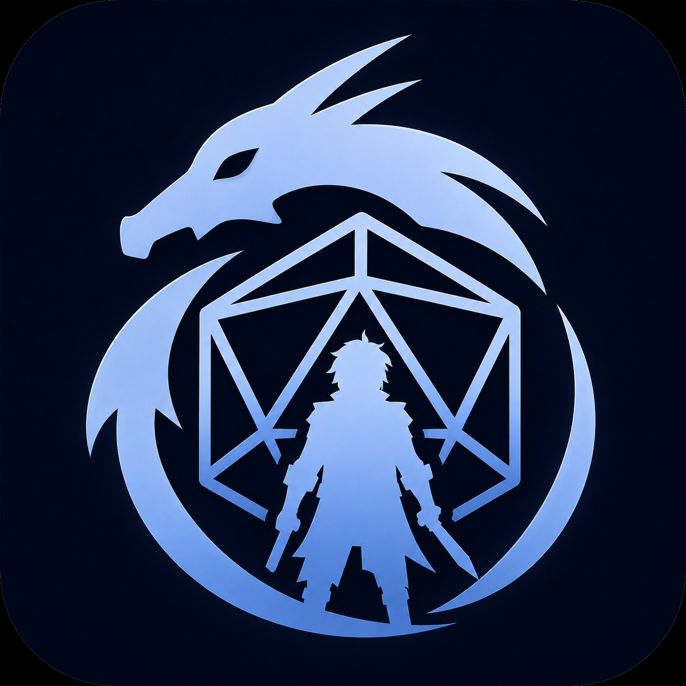

# DnDino Hero

{ .img-logo }

**DnDino Hero** è l'app per i giocatori che vogliono tenere la scheda del proprio personaggio su iPad e iPhone.

Nasce per funzionare insieme a DnDino durante il gioco al tavolo, ma può essere usata anche da sola come scheda digitale completa.

## A cosa serve

DnDino Hero ti permette di gestire:

- identità del personaggio
- specie e background
- classe, sottoclasse e multiclasse
- caratteristiche, abilità e tiri salvezza
- punti ferita, dadi vita, riposi e condizioni
- attacchi con armi
- incantesimi e slot
- talenti
- equipaggiamento
- note testuali e note disegnate
- collegamento locale con DnDino
- chat privata con il DM

L'obiettivo non è sostituire il manuale, ma darti una scheda flessibile in cui inserire contenuti ufficiali, contenuti personalizzati e materiale della tua campagna.

## Filosofia della scheda

La scheda è pensata per essere generica.

Questo significa che l'app non deve contenere per forza classi, specie, talenti o regole già pronte. Puoi crearle, importarle o duplicarle secondo le esigenze del tuo tavolo.

I dati riutilizzabili sono separati dal singolo personaggio:

- una **classe** può essere associata a più personaggi
- una **specie** può essere riutilizzata senza reinserire ogni tratto
- un **background** può essere richiamato da più schede
- incantesimi, talenti e regole possono essere importati e associati quando servono

## Scheda completa e scheda compatta

DnDino Hero prevede due modi principali per consultare il personaggio:

- **Scheda Completa**, più ricca e dettagliata
- **Scheda Compatta**, più densa e pensata per avere molte informazioni in poco spazio

La modalità preferita si sceglie dalle impostazioni.

!!! tip
    La scheda compatta è utile durante la sessione, quando vuoi vedere rapidamente punti ferita, classe armatura, iniziativa, tiri salvezza, attacchi, incantesimi e risorse.

La scheda compatta è pensata anche per iPhone: comprime le informazioni principali, usa pannelli richiudibili e lascia accessibili le azioni più frequenti come punti ferita, dadi vita, riposi, condizioni, attacchi e incantesimi preparati.

## Collegamento con DnDino

La comunicazione con DnDino è pensata per il gioco locale al tavolo, sulla stessa rete o a distanza ravvicinata.

Da Hero puoi cercare una sessione DnDino attiva, collegarti all'avventura del master e inviare il personaggio attivo. Quando un collegamento è già stato fatto in passato, la hero della scheda mostra anche un collegamento rapido all'ultimo DnDino usato, con nome del master e avventura.

Il collegamento può sincronizzare:

- punti ferita attuali, massimi e temporanei
- classe armatura
- condizioni
- dadi vita spesi
- ispirazione eroica
- dati principali del personaggio esportato verso DnDino

Quando DnDino è in combattimento, gli aggiornamenti vengono applicati al personaggio del combattimento e restano collegati alla scheda di Hero. Quando Hero torna in primo piano, prova a riconnettersi e DnDino invia di nuovo lo stato autorevole del personaggio.

## Chat privata con il DM

Se il personaggio è collegato a DnDino, puoi usare la sezione **Messaggio privato al DM**.

La chat è testuale, separata per dispositivo e personaggio, e mostra i messaggi con uno stile a bolle. Su DnDino il DM può aprire la chat dal pannello del collegamento, dalla card del personaggio avventura o dalle azioni rapide durante il combattimento.

## Da dove iniziare

Il percorso consigliato è:

1. crea il tuo personaggio
2. inserisci identità, specie e background
3. scegli o crea la classe
4. completa caratteristiche, punti ferita, classe armatura e iniziativa
5. aggiungi attacchi, incantesimi, talenti ed equipaggiamento
6. abilita il backup iCloud se vuoi proteggere i dati
7. se giochi con DnDino, collega il personaggio all'avventura del master

!!! note
    I contenuti restano locali al dispositivo, salvo le funzioni di backup iCloud quando abilitate nelle impostazioni.
