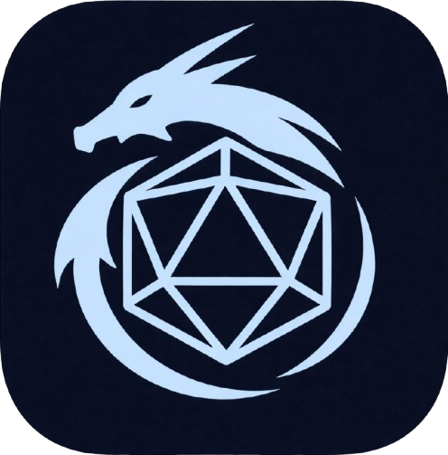

# Guida DnDino

Benvenuto nella guida ufficiale di **DnDino** e **DnDino Hero**.

{ .img-logo }

La guida è divisa in due macrosezioni:

- **DnDino**, dedicata al master e alla gestione di avventure, luoghi, combattimenti, regole e materiali.
- **DnDino Hero**, dedicata ai giocatori e alla scheda del proprio personaggio su iPad e iPhone.

<a class="guide-product-card guide-product-card-dm" href="getting-started/overview/">
  Master
  <strong>DnDino</strong>
  Prepara e gestisci campagne, personaggi, luoghi, sessioni live e combattimenti.
</a>

<a class="guide-product-card guide-product-card-hero" href="companion/overview/">
  Giocatori
  <strong>DnDino Hero</strong>
  Gestisci scheda, incantesimi, attacchi, equipaggiamento, note, chat DM e collegamento locale con DnDino.
</a>

## DnDino

DnDino è un'app pensata per aiutare il master a gestire in modo rapido e ordinato:

- avventure
- eroi, PNG e mostri
- luoghi e sottoluoghi
- presenze nei luoghi
- combattimenti
- sessione live per i giocatori
- immagini, mappe e materiali di supporto
- regole
- equipaggiamento
- incantesimi

## DnDino Hero

DnDino Hero è l'app companion per il giocatore. Può essere usata insieme a DnDino al tavolo oppure come scheda indipendente.

Con DnDino Hero puoi:

- creare e gestire uno o più personaggi
- compilare identità, specie, background, classi, sottoclassi e multiclasse
- gestire punti ferita, dadi vita, ispirazione eroica, condizioni e riposi
- consultare caratteristiche, abilità, tiri salvezza, attacchi, incantesimi, talenti, equipaggiamento e note
- importare ed esportare contenuti riutilizzabili come classi, specie, background, talenti, regole e incantesimi
- collegarti localmente a DnDino durante la sessione
- sincronizzare PF, condizioni, ispirazione eroica e dati di combattimento con il master
- usare una chat privata con il DM
- eseguire backup e ripristino tramite iCloud quando abilitato

!!! note
    Per ora la sezione **DnDino Hero** parte in italiano. Le altre lingue verranno aggiunte mano mano, dopo aver stabilizzato contenuti e terminologia.

## Cosa puoi fare con DnDino

Con DnDino puoi:

- creare e gestire eroi, PNG e mostri
- organizzare i luoghi in modalità ad albero oppure con mappe interattive
- collegare presenze e immagini ai luoghi
- preparare un combattimento prima dell'inizio dello scontro
- gestire round, danni, cure, condizioni e note DM durante il combattimento
- con un secondo schermo puoi mostrare ai giocatori immagini, animazioni e riepiloghi tramite la Finestra Giocatori

## Sezioni principali

### Home Page

La Home Page è la schermata principale, da cui puoi accedere rapidamente a tutte le sezioni del programma. È presente anche una card in primo piano in cui viene mostrata l'ultima avventura aperta.

### Avventure

La sezione `Avventure` raccoglie tutte le avventure che hai creato. Da qui puoi crearne di nuove o aprire quelle già esistenti. È il vero cuore creativo del programma, dove la campagna prende forma.

### Eroi, PNG e Mostri

Qui trovi tutto quello che riguarda personaggi e creature:

- creazione
- modifica
- immagini
- incantesimi

### Regole

La sezione `Regole` raccoglie le regole di cui puoi aver bisogno durante le tue avventure. Non serve copiarti tutto il manuale: conviene annotare solo quello che ti torna davvero utile avere sotto mano. C'è anche una sezione per i `Talenti`, in cui conservare le opzioni più rilevanti per il tuo tavolo.

### Generatore di Nomi

Il `Generatore di Nomi` è il posto in cui puoi generare velocemente nomi per razza e sesso, così da non rimanere a corto di idee quando i tuoi giocatori fermano tutti i passanti o deviano da ciò che avevi preparato.

### Impostazioni

Per configurare comportamento, layout e preferenze dell'app.

### Guide pratiche

In questa sezione trovi casi d'uso concreti per aiutarti a comprendere meglio i flussi più importanti dell'app.

## Suggerimenti per usare bene la guida

- usa la barra di ricerca per trovare velocemente una funzione
- consulta l'indice laterale per passare da un'area all'altra
- scegli prima la macrosezione corretta: **DnDino** per il master, **DnDino Hero** per il giocatore
